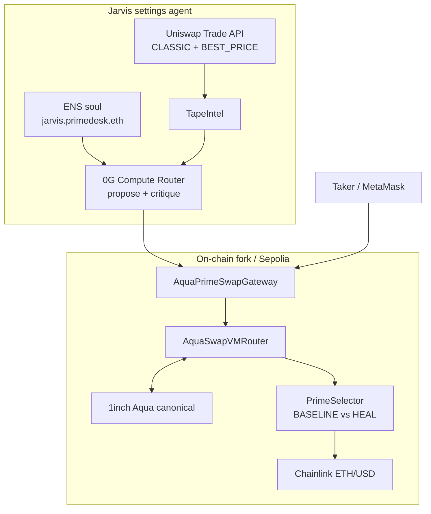

# Prime Desk

Inventory-healing market-making desk on **1inch Aqua + SwapVM**, operated by **Jarvis**.

ETHGlobal hackathon project. Self-custodied WETH/USDC book. Jarvis is a voice desk agent: soul on ENS, brain on 0G Compute, fair tape from the Uniswap Trade API. Settlement is on-chain via a custom SwapVM program.

> **Thesis: maker-side best execution.** DeFi LPs get one passive curve. A TradFi desk shades quotes against imbalance, anchors to a reference, and picks an execution model. Prime Desk is that layer as SwapVM bytecode over Aqua liquidity, retuned by an agent from live market data.

## What we built

| Layer | What it does | Where |
|-------|-------------|-------|
| **SkewPricer** (custom SwapVM opcode) | Shades quote by virtual-balance imbalance so trades heal the book (bounded, oracle-normalized) | [`reference/swap-vm/src/instructions/SkewPricer.sol`](reference/swap-vm/src/instructions/SkewPricer.sol) |
| **PrimeSelector** (maker SOR) | Extruction target: runs candidate programs on one book, picks by `takerValue - λ·\|postSkew\|` | [`reference/swap-vm/src/apps/PrimeSelector.sol`](reference/swap-vm/src/apps/PrimeSelector.sol) |
| **AquaPrimeSwapGateway** | Quote + swap, desk-set lifecycle (`stageDeskSet` → Aqua dock/ship → `finalizeDeskSet`), on-chain 0G attestation | [`reference/swap-vm/src/apps/AquaPrimeSwapGateway.sol`](reference/swap-vm/src/apps/AquaPrimeSwapGateway.sol) |
| **Jarvis** | Voice console; Uniswap TapeIntel retunes heal knobs (0G or local); commit on-chain | [`aqua-prime-scaffold/lib/jarvis/`](aqua-prime-scaffold/lib/jarvis) |
| **ENS soul** | `jarvis.primedesk.eth` text records + agent card; `maker.primedesk.eth` for the desk | [`docs/ENS_SETUP.md`](docs/ENS_SETUP.md) |
| **Terminal** | `/desk` terminal + `/jarvis` console | [`aqua-prime-scaffold/`](aqua-prime-scaffold) |

## Architecture



**Demo flow**

1. Maker ships WETH/USDC virtual balances to Aqua once. Tokens stay in the wallet until a swap settles.
2. Talk to Jarvis (or Consult Jarvis). It pulls Uniswap CLASSIC + BEST_PRICE, builds TapeIntel, proposes desk knobs via 0G or local heuristics.
3. Execute: `stageDeskSet` → Aqua `dock`/`ship` → `finalizeDeskSet` → `swapExactIn`.
4. SwapVM races BASELINE vs HEAL; selector picks; Aqua settles.

The AI does not invent prices. It only turns bounded knobs. Caps live in the gateway (`MAX_HEAL_K`, `MAX_ADJUSTMENT`, `MAX_HEAL_PREMIUM`, λ range). Tests enforce `quoteExactIn == swapExactIn`.

## Prize alignment

### 1inch (Aqua / SwapVM)

- Custom opcode `SkewPricer` at the end of `AquaOpcodes` (backward compatible); router redeployed.
- `PrimeSelector` as extruction: same scoring for quote and swap; transient route for gateway events.
- Aqua SLAC as intended: one wallet book; retunes via `dock` + `ship`; `safeBalances`.
- Demo against canonical mainnet Aqua `0x4a055AA172C98ec32de118B9B5b6AC8B4099A580` on a fork.
- On-chain ERC20 movement in fork tests and the live demo.
- Evidence: Prime Foundry suites (unit, e2e, fuzz, fork) on a `1inch/swap-vm` fork.

### 0G

- Desk brain via 0G Compute Router (`lib/jarvis/og.ts`).
- Critique pass when edge vs Uniswap is worse than -8 bps.
- Attestation hash on-chain in `DeskSetCommitted` and optionally to ENS `agent.attestation`.
- No `ZEROG_API_KEY` → local heuristic (`mode: "local"`).

### ENS

- Agent soul in ENS text records on `jarvis.primedesk.eth`.
- Desk identity on `maker.primedesk.eth`.
- Setup: [`docs/ENS_SETUP.md`](docs/ENS_SETUP.md).

### Uniswap Foundation - Trade API as agent decision fuel

Uniswap is **not** the settlement venue. It is the **mainnet fair tape** Jarvis uses to retune heal knobs before Aqua/SwapVM settles on the fork (or Sepolia).

**Endpoint.** Server-side only (key never hits the browser):

```
POST https://trade-api.gateway.uniswap.org/v1/quote
Headers: x-api-key, x-universal-router-version: 2.0
Body:    type=EXACT_INPUT, tokenIn/tokenOut = mainnet WETH <-> USDC
```

**Call sites (line-anchored):**

| What | Where |
|------|-------|
| Trade API URL constant | [`tapeIntel.ts#L8`](aqua-prime-scaffold/lib/jarvis/tapeIntel.ts#L8) |
| `fetch(QUOTE_URL, …)` CLASSIC + BEST_PRICE | [`tapeIntel.ts#L178`](aqua-prime-scaffold/lib/jarvis/tapeIntel.ts#L178) |
| `fetchTapeIntel` pack for Jarvis / 0G | [`tapeIntel.ts#L236`](aqua-prime-scaffold/lib/jarvis/tapeIntel.ts#L236) |
| Desk/UI quote route (`/api/uniswap-quote`) | [`uniswap-quote/route.ts#L9`](aqua-prime-scaffold/app/api/uniswap-quote/route.ts#L9) |

**Two quotes per ticket (parallel).** For the on-screen size and side we fetch:

| Preference | Role |
|------------|------|
| `CLASSIC` | AMM / Universal Router fair reference. Desk edge bps is measured against this. |
| `BEST_PRICE` | May include UniswapX fillers. Compared to CLASSIC to detect "filler fantasy". |

**What we parse into `TapeIntel`.** [`tapeIntel.ts`](aqua-prime-scaffold/lib/jarvis/tapeIntel.ts) normalizes both response shapes (nested `quote.*` vs top-level; UniswapX `orderInfo.outputs` start/end amounts):

| Field | How Jarvis / the UI uses it |
|-------|-----------------------------|
| `amountOut` (CLASSIC) | Fair reference; `edgeDeskVsClassicBps` |
| `amountOut` (BEST_PRICE) | `bestVsClassicBps`; if gap is wide -> `fillerGapWide` (trust CLASSIC, cut premium) |
| `priceImpact` | Thin-book signal -> cut `maxAdjustment` / `healK` |
| `gasFeeUSD` | Prompt + tape strip |
| `routeString`, fee tiers, hops | Route quality; multi-hop / high fee -> `thinLiquidity` |
| UniswapX start/end | Auction softness (informational) |
| `blockNumber` | Freshness stamped into the 0G prompt |

**Where it shows up.**

1. **Desk tape** - [`/api/uniswap-quote`](aqua-prime-scaffold/app/api/uniswap-quote/route.ts#L9) feeds the terminal reference mid (`TradeTapePanel`).
2. **Jarvis consult** - `TapeIntel` is injected as `uniswapTape` into local heuristics ([`fallback.ts`](aqua-prime-scaffold/lib/jarvis/fallback.ts)) and the 0G prompt ([`prompt.ts`](aqua-prime-scaffold/lib/jarvis/prompt.ts)). Critique re-runs if desk edge vs CLASSIC is worse than -8 bps.
3. **UI strip** - impact, route, edge, thin/filler flags on the Jarvis console.

**Hard boundary.** We never call Uniswap `/swap`. Settlement is Aqua `dock`/`ship` + `swapExactIn`. Mainnet tape vs fork settlement is labeled in the UI.

Hackathon feedback: [`aqua-prime-scaffold/FEEDBACK.md`](aqua-prime-scaffold/FEEDBACK.md). Spec: [`docs/UNISWAP_JARVIS.md`](docs/UNISWAP_JARVIS.md).

## Proof

```bash
cd reference/swap-vm && forge test --match-contract "AquaPrime|SkewPricer"
```

| Suite | What it proves |
|-------|----------------|
| `SkewPricer*.t.sol` | Skew math, caps, quote==swap |
| `AquaPrime.t.sol` | Ship → route → settle; selector flips |
| `AquaPrimeBranchRouting.t.sol` | Branch wins vs Chainlink books |
| `AquaPrimeMiddleGround.t.sol` | Bounded skew LP protection |
| `AquaPrimeGateway.t.sol` | Desk-set lifecycle, caps, events, fuzz quote==swap |
| `AquaPrimeFork.t.sol` | Mainnet fork: live Chainlink, real ERC20, healing |

## Run

Needs Foundry, Node 18+, Yarn, bash (Git Bash on Windows).

```bash
bash scripts/dev-aqua-prime.sh
```

- Jarvis: [http://localhost:3000/jarvis](http://localhost:3000/jarvis)
- Desk: [http://localhost:3000/desk](http://localhost:3000/desk)
- MetaMask: RPC `http://127.0.0.1:8545`, chain id `31337`

Copy [`aqua-prime-scaffold/.env.example`](aqua-prime-scaffold/.env.example) → `.env.local`. Set `UNISWAP_API_KEY`, optional `ZEROG_API_KEY`, `NEXT_PUBLIC_WALLET_CONNECT_PROJECT_ID`, and an archive `MAINNET_RPC_URL` for the fork script.

Demo notes: [`DEMO.md`](DEMO.md). Uniswap tape spec: [`docs/UNISWAP_JARVIS.md`](docs/UNISWAP_JARVIS.md).

## Layout

```
reference/swap-vm/       # SwapVM fork + SkewPricer, PrimeSelector, gateway, tests, deploy
aqua-prime-scaffold/     # Next.js desk + Jarvis
scripts/                 # one-command fork demo
docs/                    # ENS setup + Uniswap tape spec
DEMO.md
```

## Limits

- Skew reduces inventory drift; it does not guarantee profit.
- Selector gas grows with branches (v1 caps at 3).
- Uniswap tape is mainnet reference while settlement is fork/Sepolia (UI labels this).
- 0G output is clamped on-chain; no key means local mode.
- Desk retunes need the maker wallet (Aqua `dock`/`ship`).
