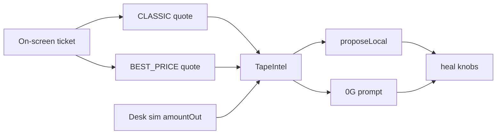

# Uniswap API → Jarvis tape intel

Simple path: **two Uniswap quotes → one `TapeIntel` object → feed Jarvis (local + 0G).**

Settlement stays on Aqua/SwapVM.



## What we read from Uniswap

| Field | Use |
|-------|-----|
| `amountOut` (CLASSIC) | Fair AMM reference + desk edge bps |
| `amountOut` (BEST_PRICE) | Filler / UniswapX comparison |
| `priceImpact` | Thin-book flag → cut `maxAdj` |
| `gasFeeUSD` | Shown in intel / prompt |
| `routeString` + fee tiers + hops | Route quality / thinLiquidity |
| UniswapX start/end | Auction softness (informational) |
| `blockNumber` | Freshness in prompt |

## Code

| File | Role |
|------|------|
| [`tapeIntel.ts`](../aqua-prime-scaffold/lib/jarvis/tapeIntel.ts) | Fetch + parse + summary |
| [`fallback.ts`](../aqua-prime-scaffold/lib/jarvis/fallback.ts) | Local knobs from intel |
| [`prompt.ts`](../aqua-prime-scaffold/lib/jarvis/prompt.ts) | `uniswapTape` JSON for 0G |
| [`AquaTapeIntel.tsx`](../aqua-prime-scaffold/components/AquaTapeIntel.tsx) | UI strip |

## Verify

```bash
cd aqua-prime-scaffold && yarn tsc --noEmit && npx --yes tsx lib/jarvis/tapeIntel.selfcheck.ts
```

## Out of scope

- TAKE/HEAL/PRIME multi-size scan (removed — too heavy)
- Uniswap `/swap` execution
- Realized vol history
